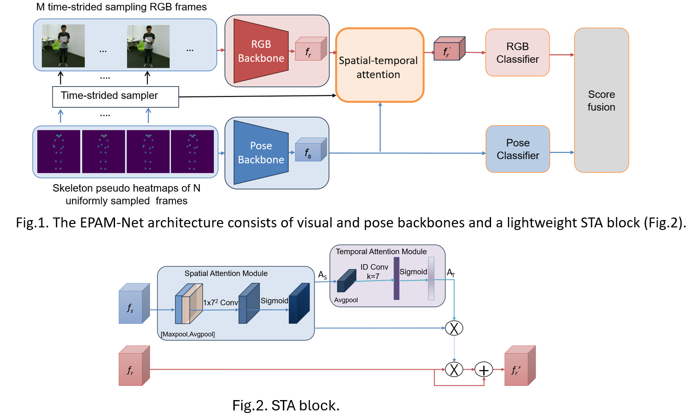

# Multimodal-Action-Recognition
This repo is the official implementation for **EPAM-Net: An Efficient Pose-driven Attention-guided Multimodal Network for Video Action Recognition**, which is accepted by **Neurocomputing 2025**.
[](https://www.arxiv.org/abs/2408.05421) <br />
Paper: https://www.sciencedirect.com/science/article/pii/S0925231225004539

## Introduction
Existing multimodal-based human action recognition approaches are either computationally expensive, which limits their applicability in real-time scenarios, or fail to exploit the spatial temporal information of multiple data modalities. In this work, we present a novel and efficient pose-driven attention-guided multimodal network (EPAM-Net) for action recognition in videos. Specifically, we propose eXpand temporal Shift (X-ShiftNet) convolutional architectures for RGB and pose streams to capture spatio-temporal features from RGB videos and their skeleton sequences. The X-ShiftNet tackles the high computational cost of the 3D CNNs by integrating the Temporal Shift Module (TSM) into an efficient 2D CNN, enabling efficient spatiotemporal learning. Then skeleton features are utilized to guide the visual network stream, focusing on keyframes and their salient spatial regions using the proposed spatial–temporal attention block. Finally, the predictions of the two streams are fused for final classification.. The proposed architecture achieved comparative performance with state-of-the-art methods on NTU RGB-D 60, NTU RGB-D 120, PKU-MMD, and Toyota SmartHome datasets with up to a 72.8x reduction in FLOPs and up to a 48.6x reduction in the number of network parameters.


# Download dataset
1. **NTU-RGB+D 60** dataset from [https://rose1.ntu.edu.sg/dataset/actionRecognition/](https://rose1.ntu.edu.sg/dataset/actionRecognition/)
2. **NTU-RGB+D 120** dataset from [https://rose1.ntu.edu.sg/dataset/actionRecognition/](https://rose1.ntu.edu.sg/dataset/actionRecognition/)
3. **PKU-MMD** dataset from [https://www.icst.pku.edu.cn/struct/Projects/PKUMMD.html](https://www.icst.pku.edu.cn/struct/Projects/PKUMMD.html)
4. **Toyota SmartHome** trimmed dataset from [https://project.inria.fr/toyotasmarthome/](https://project.inria.fr/toyotasmarthome/)

# Architecture of EPAM-Net

## Results and Models

### NTU60

### NTU120

### PKU-MMD

### Toyota-Smarthome

## Train

## Inference 
You can use the following command to test a unimodal model.
```shell
python inference/test.py
```
You can use the following command to test a multimodal model.
```shell
python inference/test_multimodal.py
```
